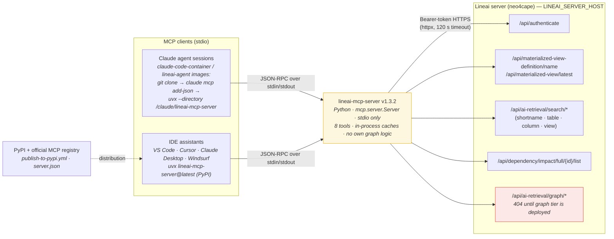
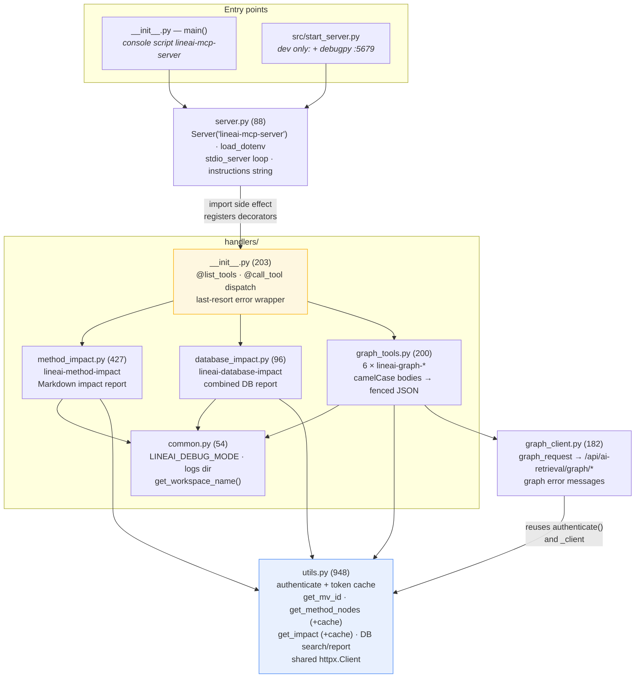
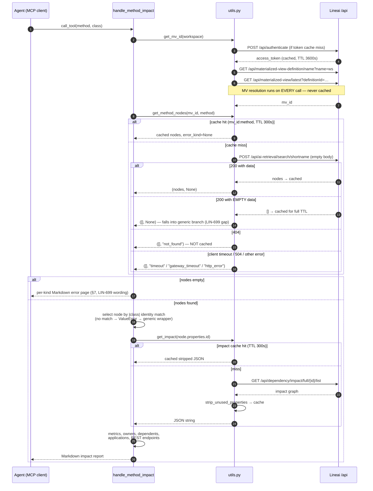
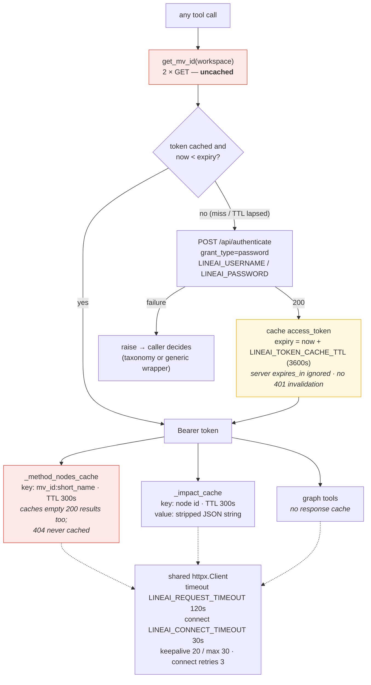
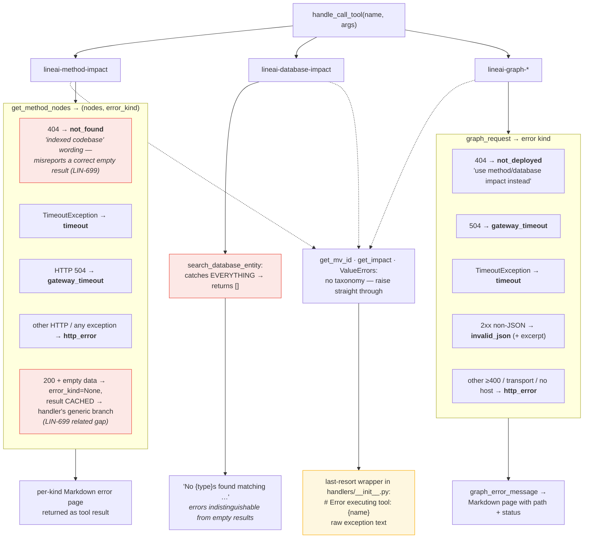

# lineai-mcp-server — Architecture Diagrams

Companion to [architecture.md](architecture.md); same source-verified content
(`main` @ `6fdff87`, v1.3.2, 2026-10-05) rendered as Mermaid. Committed SVG renders
live in [rendered-diagrams/](rendered-diagrams/index.md), one per section, named by
the section's two-digit prefix.

> Written for Linear ticket **LIN-737**; the error-wording issue in diagram 05 is
> tracked as **LIN-699**.

---

## 01 — Ecosystem: where lineai-mcp-server sits

---

## 02 — Module map

---

## 03 — `lineai-method-impact` call sequence (richest path, with error branches)

---

## 04 — Authentication and the three caches

---

## 05 — Error-handling taxonomy (and where it leaks)

