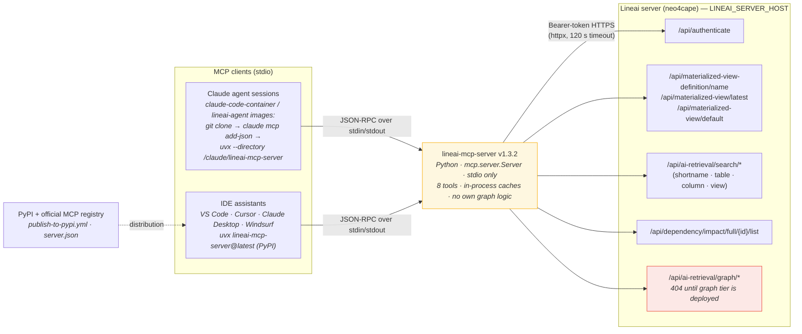
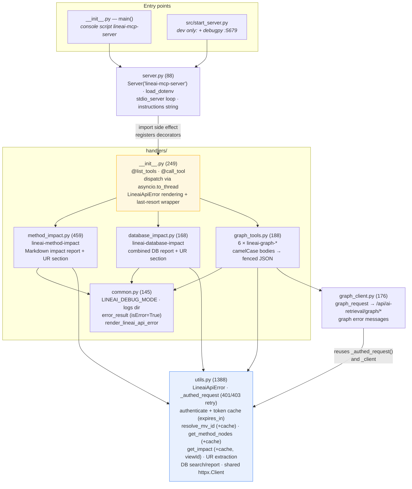
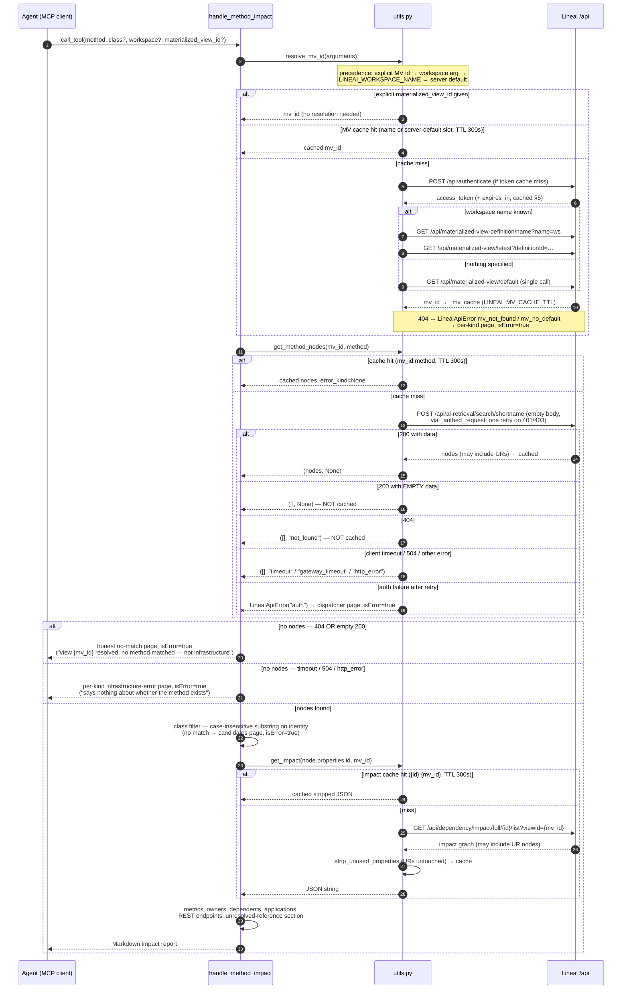
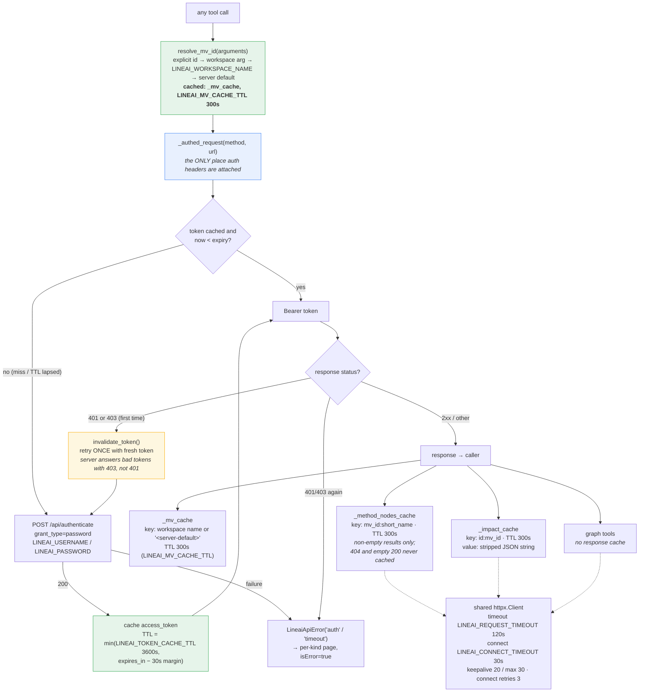
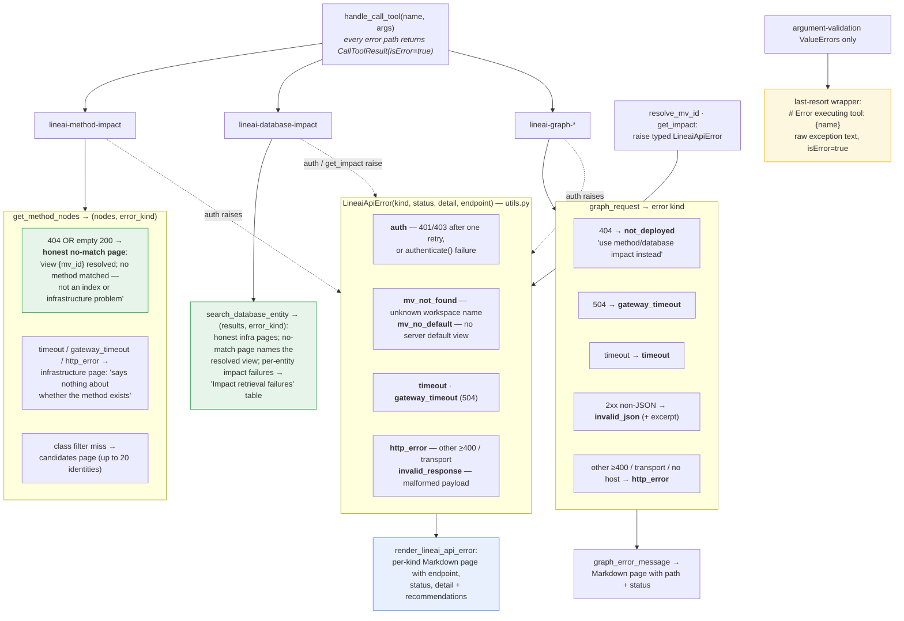

# lineai-mcp-server — Architecture Diagrams

Companion to [architecture.md](architecture.md); same source-verified content
(`main` @ `e539ba9`, v1.3.2, 2026-10-05) rendered as Mermaid. Committed SVG renders
live in [rendered-diagrams/](rendered-diagrams/index.md), one per section, named by
the section's two-digit prefix.

> Written for Linear ticket **LIN-737**. **Updated for LIN-699** (PR #61 in this
> repo; server side neo4cape PR #1860): diagrams 03–05 now show the typed
> `LineaiApiError` taxonomy with `isError=True`, the honest no-match routing,
> the 401/403 auth retry with `expires_in` handling, the MV-resolution cache,
> and `viewId`-scoped impact fetches.

---

## 01 — Ecosystem: where lineai-mcp-server sits

---

## 02 — Module map

---

## 03 — `lineai-method-impact` call sequence (richest path, with error branches)

---

## 04 — Authentication and the four caches

---

## 05 — Error-handling taxonomy (honest since LIN-699 / PR #61)

